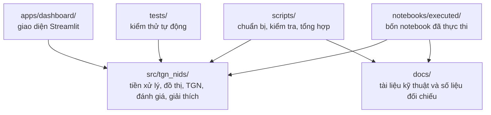
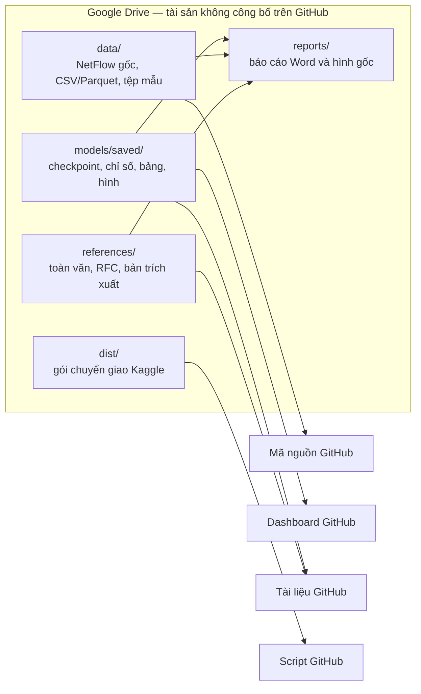

# Sơ đồ kiến trúc dự án và vị trí tài sản

Tài liệu này mô tả toàn bộ đồ án theo hai nơi lưu trữ: mã và tài liệu kỹ thuật
công khai trên GitHub; dữ liệu, đầu ra thực nghiệm và tài liệu toàn văn trong
gói Google Drive đi kèm. Sơ đồ không ngụ ý rằng các tài sản trên Drive có mặt
trong bản sao GitHub.

## 1. Phần công khai trên GitHub

`src/tgn_nids/` là thư viện dùng chung. Dashboard, script, kiểm thử và notebook
đã thực thi đều dựa vào các thành phần trong thư viện này; `docs/` giải thích
kiến trúc, giao thức đo và kết quả đã công bố.

## 2. Tài sản trong gói Google Drive

Các mũi tên biểu diễn quan hệ sử dụng hoặc đối chiếu, không phải cơ chế tự động
tải tệp. Khi clone kho GitHub, các thư mục trên Drive không xuất hiện trong cây
làm việc.

## 3. Luồng sử dụng

1. Cài môi trường từ `requirements.txt` và mã trong `src/`.
2. Chạy `pytest` để kiểm tra phần công khai không cần dữ liệu lớn.
3. Dùng dashboard ở chế độ trình diễn nếu chưa có checkpoint.
4. Khi cần tái tạo môi trường dữ liệu, suy luận bằng trọng số đã chốt hoặc đối
   chiếu số liệu gốc, lấy đúng thư mục tương ứng từ gói Drive.
5. Dùng danh mục trong `references/TAI_LIEU_THAM_KHAO.md` trên GitHub để tra
   cứu; chỉ xem bản toàn văn trong Drive khi có quyền sử dụng phù hợp.

## 4. Phân định trách nhiệm

| Nơi lưu | Vai trò |
| --- | --- |
| GitHub | Mã nguồn, kiểm thử, dashboard, script, tài liệu kỹ thuật và notebook đã thực thi. |
| Google Drive | Dữ liệu lớn, checkpoint, kết quả đã chốt, gói bàn giao, báo cáo hoàn chỉnh và toàn văn tài liệu tham khảo. |

Không ghi đè dữ liệu, checkpoint hoặc đầu ra đã chốt trong gói Drive khi chỉ
cần kiểm tra hoặc trình bày lại kết quả.
