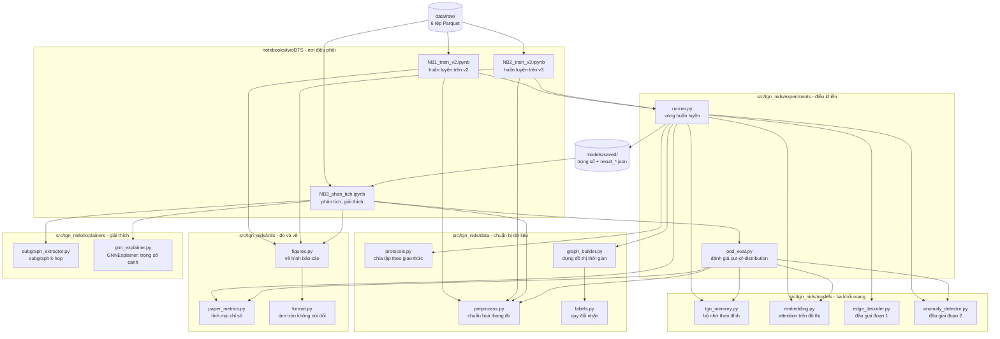
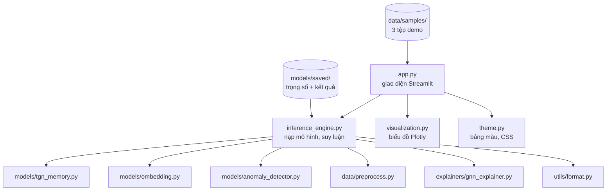
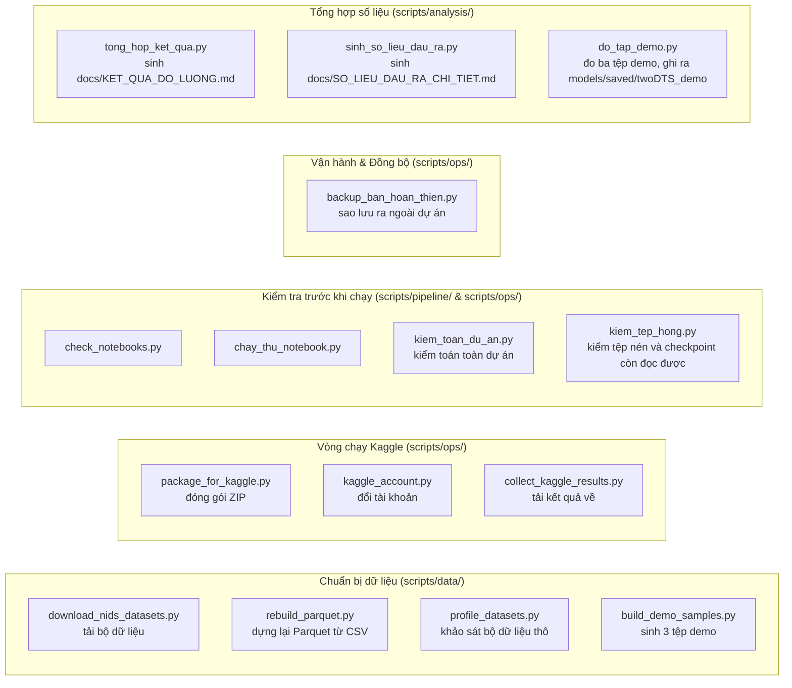
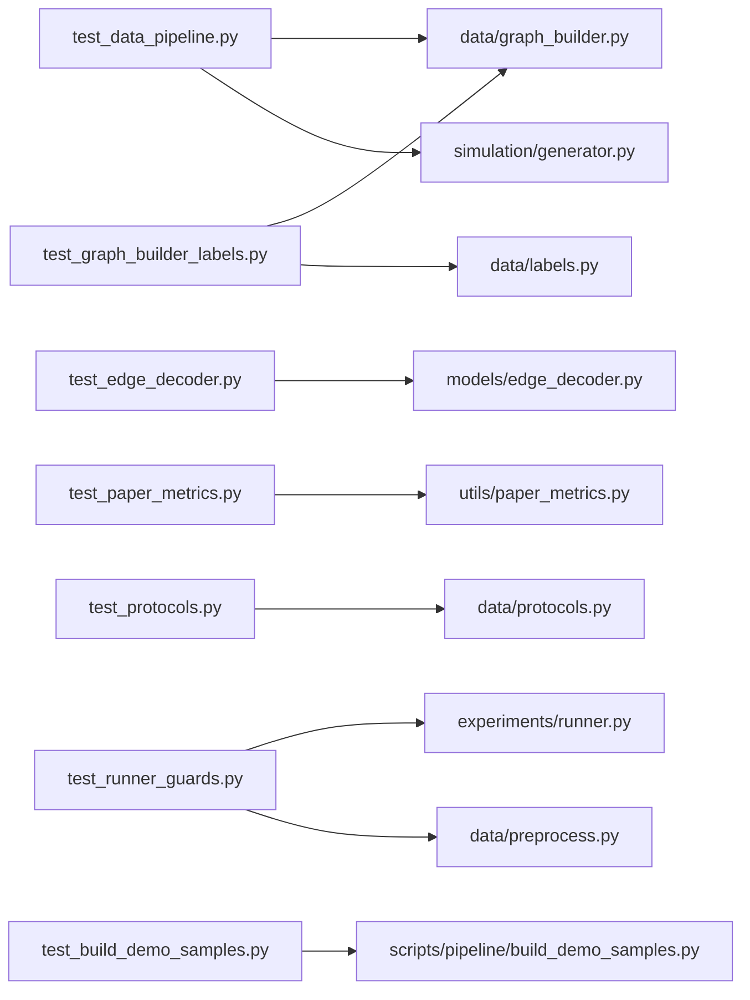

<!-- kiem-toan: tep nay ghi nhan viec da xoa, nen duoc phep nhac ten cac thu da bi xoa khoi du an -->

# Sơ đồ kiến trúc và móc nối giữa các tệp

Mọi mũi tên trong tài liệu này đều
dựng từ câu lệnh `import` thật trong mã, không vẽ theo trí nhớ.

---

## 1. Khối chính: đường đi từ dữ liệu thô tới kết quả

Đây là khối làm nên đồ án. Đọc từ trên xuống là đúng thứ tự dữ liệu chảy qua.

**Cách đọc.** Notebook là nơi điều phối, không phải nơi chứa thuật toán: chúng
nạp dữ liệu thô, dựng `NetFlowPreprocessor`, gọi `runner.py`, rồi vẽ hình. Toàn
bộ phần tính toán nằm trong `src/tgn_nids/`. Nhờ tách như vậy, đổi một siêu tham
số chỉ phải sửa ô tham số của notebook, không đụng tới mã mô hình.

Chú ý chiều mũi tên ở `preprocess.py`: **notebook tạo ra bộ tiền xử lý rồi truyền
vào `runner`**, chứ `runner` không tự nhập nó. Nhờ vậy cùng một bộ tiền xử lý đã
khớp trên tập huấn luyện được dùng lại nguyên vẹn cho tập kiểm thử và cho
dashboard, thay vì mỗi nơi khớp một bộ riêng.

`labels.py` chỉ có một nơi gọi là `graph_builder.py`, tại bước quy đổi nhãn lúc
dựng đồ thị.

Ba công cụ giải thích trả lời ba câu hỏi khác nhau và nằm ở ba nơi khác nhau.
`SubgraphExtractor` cho biết cảnh báo nằm ở đâu trong mạng, notebook gọi trực
tiếp. `GNNExplainer` cho biết cạnh lân cận nào giữ quyết định, cũng do notebook
gọi. `TGNExplainer` cho biết đặc trưng nào đẩy quyết định, và **chỉ dashboard
gọi**; notebook tự triệt tiêu từng cột ngay trong ô mã rồi gọi lại
`evaluate_ood_binary`, nên không đi qua lớp đó.

Cả ba đều **hậu nghiệm**: chúng nạp mô hình đã lưu, đóng băng trọng số, và
`runner.py` không nhập tệp nào trong nhóm này. Ô mã của mục 8 trong notebook còn
so trọng số trước và sau mỗi lần giải thích, dừng với lỗi nếu có tham số nào bị
đổi.

**Ba khối mạng nối tiếp nhau** theo đúng thứ tự `tgn_memory` rồi `embedding` rồi
một trong hai đầu ra. Giai đoạn một dùng `edge_decoder`, giai đoạn hai dùng
`anomaly_detector`. Đây là lý do checkpoint của hai giai đoạn có tiền tố khoá
khác nhau, `decoder.` và `detector.`.

---

## 2. Khối trình diễn: dashboard

Khối này đọc kết quả của khối chính, không sinh ra kết quả mới.

**Điểm cần nhớ.** Dashboard dùng lại đúng ba khối mạng của khối chính, nên nó
không thể "chạy khác" mô hình đã huấn luyện. Nó cũng dùng chung `utils/format.py`
với phần báo cáo, nên một tỷ lệ hiện trên màn hình và cùng tỷ lệ đó in trong báo
cáo đi qua đúng một phép làm tròn.

Chỗ còn cài hai bản: dashboard **tự dựng đồ thị lân cận** bằng mã riêng trong
`inference_engine.py` chứ không gọi `subgraph_extractor.py`. Hai bản từng khác
nhau về chiều duyệt, và lỗi chỉ lộ ra khi lần đầu có người gọi bản thứ hai.

---

## 3. Khối công cụ: scripts

Không tệp nào ở đây tham gia vào việc sinh ra con số của báo cáo. Chúng là công
cụ vận hành.

Các công cụ vận hành phục vụ tự động hóa chu trình chuẩn bị dữ liệu, điều phối huấn luyện từ xa trên Kaggle, và thẩm định tính toàn vẹn của dự án trước và sau mỗi phiên làm việc. Chúng độc lập với mã nguồn lõi của mô hình và không can thiệp vào các tham số đã khóa.

---

## 4. Khối kiểm thử

Bảy tệp kiểm thử, 65 phép. Chúng phủ phần dữ liệu và phần đo, không phủ phần
giao diện: dashboard kiểm bằng cách chạy thật với ba tệp demo.

---

## 5. Những tệp nằm ngoài mọi sơ đồ trên

Ba nhóm dưới đây không có mũi tên nào nối tới mã đang chạy.

**Notebook đã thực thi** trong `notebooks/executed/`: ba tệp `.ipynb` giữ nguyên
đầu ra của một lần chạy cụ thể, chỉ để đọc và làm bằng chứng. Không tệp nào nạp
chúng.

**Tài liệu và kết quả**: toàn bộ `docs/`, `reports/`, `models/saved/`,
`data/` là dữ liệu chứ không phải mã. `models/saved/` là điểm nối duy nhất giữa
khối chính và khối trình diễn.

---

## 6. Ba quy tắc rút ra từ sơ đồ

**Một, mọi con số đi qua đúng một cửa.** `paper_metrics.py` là nơi duy nhất tính
chỉ số, cho cả huấn luyện lẫn đánh giá out-of-distribution. Sửa sai ở đó thì sai
toàn bộ báo cáo, nên đó là tệp cần đọc kỹ nhất khi nghi ngờ kết quả.

**Hai, dashboard không có đường tắt.** Nó nạp đúng ba khối mạng của khối chính.
Nếu màn hình hiện số khác báo cáo thì nguyên nhân nằm ở dữ liệu đầu vào hoặc
điểm làm việc, không phải ở chỗ mô hình khác nhau.

**Ba, một chức năng cài hai nơi là mầm lỗi.** Việc dựng đồ thị lân cận tồn tại
cả trong `subgraph_extractor.py` lẫn trong `inference_engine.py`. Hai bản từng
khác nhau về chiều duyệt, và lỗi chỉ lộ ra khi lần đầu có người gọi bản thứ
nhất. Chỗ nào còn trùng lặp như vậy thì phải hoặc gộp lại, hoặc ghi rõ trong mã
rằng có hai bản và vì sao.
